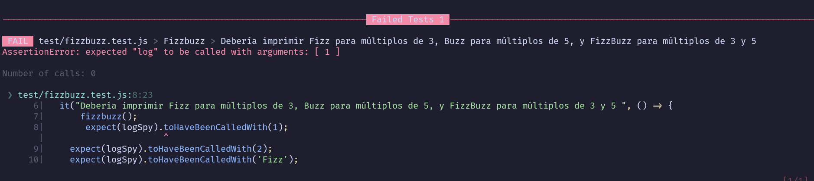
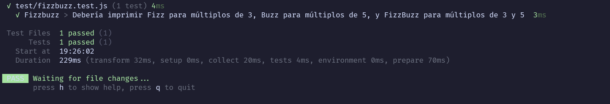

# FizzBuzz

## Requisitos

- [Node.js](https://nodejs.org/) (v18 o superior recomendado)
- npm (incluido con Node.js)
- VSCode

## Instalación

1. Descargar o clonar el repositorio
2. Abrir VScode en el repositorio 
3. Abrir la terminal integrada 
4. Instalar las dependencias necesarias para el correcto funcionamiento usando
```bash
  npm install
```

## Instrucciones

Escribir un programa con las siguientes características

1. El programa debe imprimir los números del 1 al 100.
2. Una vez que tu programa hago esto hacer los siguientes puntos.
3. Remplazar los números que sean múltiplos de 3 por la palabra Fizz.
4. Remplazar los números que sean múltiplos de 5 por la palabra Buzz.
5. Remplazar los números que sean múltiplos de 3 y 5 por la palabra FizzBuzz.


Ejemplo de Salida

1

2

Fizz

4

Buzz

Fizz

7

8

Fizz

Buzz

11

Fizz

13

14

FizzBuzz

### ¿Dondé va tu código?

Tú código debe de ir en el archizo llamado fizzbuzz.js

Dentro de la funcion llamada fizzbuzz.

Este archivo esta en la carpeta llamada src.

**Importante⚠️**

Solo debes modificar este archivo para el correcto funcionamiento de todo.


## Test
Para probar el correcto funcionamiento de tu programa debes ejecutar las pruebas que ya vienen integradas

¿Cómo ejecutar las pruebas?

1. Abrir la terminal de preferencia o la de VSCode.
2. En la terminal escribir 
```bash
  npm run test
```

Puedes ejecutar los test antes de empezar tu programa en ese caso veras un mensaje parecido a lo siguiente



Si ya terminaste tu programa y todo esta bien, veras un mensaje como este en tu terminal: 

